# 🌿 Nexa Finance - Frontend

Frontend do **Nexa Finance**, uma aplicação moderna de **gestão financeira pessoal** desenvolvida em **React Native** (mobile), com foco em controle de gastos, metas financeiras e visualização de dados de forma intuitiva e elegante.

---

## 📘 Descrição do Projeto

O **Nexa Finance** permite que usuários gerenciem suas finanças de maneira simples e eficiente.  
A interface é pensada para proporcionar **clareza, motivação e praticidade**, ajudando o usuário a entender seus hábitos financeiros e alcançar seus objetivos.

> 💡 **Objetivo**: transformar o controle financeiro em algo natural e agradável, com insights visuais e acompanhamento diário.

---

## 🧠 Principais Funcionalidades

- 💵 **Cadastro e login de usuários**
- 📊 **Visualização de gastos e ganhos**
- 🗓️ **Controle por período (semanal, mensal, anual)**
- 🎯 **Criação de metas financeiras**
- 🔐 **Criptografia de senha antes do envio ao backend**
- 🌈 **Interface responsiva e intuitiva**
- ☁️ **Integração com o backend Nexa (API REST)**

---

## ⚙️ Tecnologias Utilizadas

| Categoria | Tecnologias |
|------------|--------------|
| **Framework** | React Native |
| **Linguagem** | TypeScript |
| **Estilização** | Tailwind CSS |
| **Gerenciamento de Estado** | Context API |
| **Autenticação** | JWT / HTTPS |
| **Comunicação com API** | Axios |
| **Gráficos e Visualização** | Recharts |
| **Formulários** | React Hook Form |
| **Build & Deploy** | Vite + Netlify / Vercel |

---

🚀 Como Executar o Projeto
1️⃣ Clonar o repositório

git clone https://github.com/Nexa-Partners/nexa-finance-frontend.git
cd nexa-frontend

2️⃣ Instalar as dependências

npm install

3️⃣ Rodar o servidor de desenvolvimento

npm expo start

4️⃣ Acessar o app

Abra no navegador:
👉 http://localhost:8081
🧱 Integração com o Backend

O Nexa Frontend consome a API do Nexa Backend, responsável por autenticação, registro e análise de dados financeiros.

    Repositório do backend: nexa-backend

Fluxo de autenticação:

    O frontend requisita a chave pública RSA do backend.

    Criptografa a senha localmente.

    Envia os dados criptografados para o endpoint de login.

    Recebe o JWT e armazena de forma segura.

### 📸 Exemplos de Interface

## 📝 Documentação

> 📄 Acesso ao [Termo de anuencia no docs](https://docs.google.com/document/d/1b7rr_W3e6ecN7ZVXyZC4E3Qc2bcXIvdSlfa4_1rpiIk/edit?usp=sharing)

    "Transformando números em propósito e clareza financeira."
    — Nexa App
